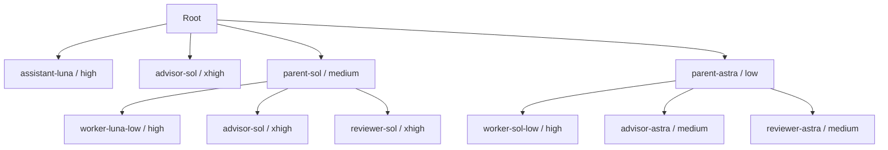

# Codexエージェントチーム

職能別ロールを廃止し、量と難度による二つの編成にする。設定値は暫定であり、最終の外部ベンチマーク・評判確認は実装後に行う。

Rootは会話の経緯を保ち、相応の依頼入力と成果物がある仕事をParentへ渡す。簡単・大量の仕事はSolが分割・指示・回収を効率よく行い、難しい・少量の仕事はAstraが前提と方針を扱う。難しい・大量の仕事は第三のチームを増やさず、計画を固めてユーザー承認を得てから実作業へ進む。

RootのLuna補助はhigh固定。明示的なParent兼務時もLuna lowは使わない。独立したSol Parentは指示と検査が明確ならLuna low、手戻りが懸念されるならhighを選ぶ。Astra ParentはSol low/highを使う。

## 異なる二つの品質基準

| 担当 | 入力 | 評価するもの |
| --- | --- | --- |
| Parent | childへの指示と結果 | 指示への適合、工程・内容・根拠・検証の妥当性 |
| Reviewer | Parentへの原依頼、解釈・方針、計画または最終成果 | ユーザー意図、論理の根幹、重要要求の充足、返却可能性 |

Parentはchildの受入時に要求を再解釈しない。指示が悪ければ指示の修正として扱う。Reviewerは細かな指摘数を成果にせず、結論や利用可能性を損なう問題に集中する。

Parentがユーザーへ返す計画・最終成果は独立レビューを経る。計画を別途返さず完結する依頼に形式的な二段階レビューは追加しない。childの途中報告、Rootの限定作業は一律対象外。AdvisorとReviewerは同じ設定でも別個体とし、助言履歴による誘導を避ける。見解相違が解消しなければParentがユーザーに確認する。

## 情報と成果の流れ

必要な原文・確定条件・権限をRootからParentへ渡し、Parentが実行可能な指示へ具体化する。workerは局所成果と根拠を返す。Parentは受入・統合・独立レビューを経て、短い結論と成果物へのリンクをRootへ返す。履歴に長大な出力を積むことを成果保存の代わりにしない。

共有済みログ・検証は再利用する。情報共有方式の詳細再編はTODOとし、現段階では案件別作業領域と必要な状態・レビュー記録を維持する。

## 正本

- [Root](../dot_codex/common/root-agent.md.tmpl)：担当選択・兼務・引継ぎ
- [チーム運用](../dot_codex/common/sub-agent.md.tmpl)：編成・選択・記録
- [Parent](../.chezmoitemplates/agent/codex/parent.md)：企画・child受入・レビュー手配
- [Worker](../.chezmoitemplates/agent/codex/worker.md)、[Advisor](../.chezmoitemplates/agent/codex/advisor.md)、[Reviewer](../.chezmoitemplates/agent/codex/reviewer.md)：担当別規範
- [設定と決定根拠](codex-agent-model-selection.md)：暫定設定・変遷・受入ケース

本資料は構造の説明であり、運用時に別の条件を追加する正本ではない。Claudeの職能ロールや共通安全規約は今回の再編対象に含めない。
