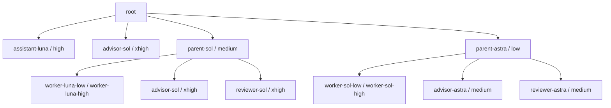

# Codexエージェントチーム

職能別ロールを廃止し、量と難度による二つの編成にする。現設定は公開ベンチマークと役割設計から弱い支持を得て維持する。最適性の実証とは区別し、満足度・使用感などを見直しの材料とする。判断根拠は [モデル選択資料](codex-agent-model-selection.md) に記録する。

## 階層と役割

階層は案件の責任範囲、役割は担当する仕事を表す。root / parent / childの関係と、worker / advisor / reviewerの役割を分けて読む。

| 階層 | 責任 | 対応する担当 |
| --- | --- | --- |
| root | ユーザーとの対話、全会話の経緯、担当選択、成果への導線 | この会話を受け持つエージェント。専用の起動ロールは定義しない |
| parent | 案件の企画、分割・指示、childの受入、統合、独立レビューの手配 | `parent-sol` / `parent-astra` |
| child | 指定範囲の仕事を返す末端担当。再委任しない | worker / advisor / reviewer。root直轄のassistant・advisorも末端担当 |

| 役割 | 担当する仕事 | 成果の使い方 |
| --- | --- | --- |
| worker | 指示された範囲の調査・実行・検証 | parentが指示への適合を確認して統合する |
| advisor | 前提、方針、選択肢、成立条件の検討 | 依頼元が助言の採否を判断する |
| reviewer | 原依頼とparentの解釈・成果を独立評価 | ユーザーへ返せるかを判定する |
| assistant | rootが指定した検索・読解・抽出・要約 | rootが必要な結果と根拠を回収する |

## 二つの編成

| 案件 | parent | worker | advisor / reviewer |
| --- | --- | --- | --- |
| 簡単・大量 | Sol / medium | Luna / low または high | Sol / xhigh |
| 難しい・少量 | Astra / low | Sol / low または high | Astra / medium |

advisorとreviewerは同じ設定でも別個体で担当する。root直轄の補助は `assistant-luna`（Luna / high）、相談は `advisor-sol`（Sol / xhigh）。全11ロールの識別子と設定は [モデル選択資料](codex-agent-model-selection.md) を参照する。

下図の矢印は起動・依頼の関係を示す。worker、advisor、reviewerの間に上下関係はない。

rootは会話の経緯を保ち、相応の依頼入力と成果物がある仕事をParentへ渡す。簡単・大量の仕事はSolが分割・指示・回収を効率よく行い、難しい・少量の仕事はAstraが前提と方針を扱う。難しい・大量の仕事は第三のチームを増やさず、計画を固めてユーザー承認を得てから実作業へ進む。

rootのLuna補助はhigh固定。明示的なParent兼務時もLuna lowは使わない。独立したSol Parentは指示と検査が明確ならLuna low、手戻りが懸念されるならhighを選ぶ。Astra ParentはSol low/highを使う。

## 異なる二つの品質基準

| 担当 | 入力 | 評価するもの |
| --- | --- | --- |
| Parent | childへの指示と結果 | 指示への適合、工程・内容・根拠・検証の妥当性 |
| Reviewer | Parentへの原依頼、解釈・方針、計画または最終成果 | ユーザー意図、論理の根幹、重要要求の充足、返却可能性 |

Parentはchildの受入時に要求を再解釈しない。指示が悪ければ指示の修正として扱う。Reviewerは細かな指摘数を成果にせず、結論や利用可能性を損なう問題に集中する。

Parentがユーザーへ返す計画・最終成果は独立レビューを経る。計画を別途返さず完結する依頼に形式的な二段階レビューは追加しない。childの途中報告、rootの限定作業は一律対象外。AdvisorとReviewerは同じ設定でも別個体とし、助言履歴による誘導を避ける。見解相違が解消しなければParentがユーザーに確認する。

## 情報と成果の流れ

必要な原文・確定条件・権限をrootからParentへ渡し、Parentが実行可能な指示へ具体化する。workerは局所成果と根拠を返す。Parentは受入・統合・独立レビューを経て、短い結論と成果物へのリンクをrootへ返す。履歴に長大な出力を積むことを成果保存の代わりにしない。

通常の実作業では次の順で進む。

1. rootが原依頼・確定条件・権限をparentへ渡す。
2. parentが方針と受入条件を具体化し、workerへ範囲を切り出す。相談が必要ならadvisorを使う。
3. parentがworkerの結果を受け入れ、案件全体の成果へ統合する。
4. 別個体のreviewerが原依頼・解釈・成果を評価する。要修正・判定不能ならparentが対応し、再確認を受ける。
5. parentが結論・検証・限界と成果物リンクをrootへ返し、rootがユーザーへ伝える。

計画を先にユーザーへ返す場合は、その計画もレビュー対象になる。難しい・大量の案件では、この計画レビューとユーザー承認を実作業の前に置く。rootがparentを明示的に兼務する場合も同じ責任を持つが、Lunaはhigh固定とする。

共有済みログ・検証は再利用する。情報共有方式の詳細再編はTODOとし、現段階では案件別作業領域と必要な状態・レビュー記録を維持する。

## 正本

- [root](../dot_codex/common/root-agent.md.tmpl)：担当選択・兼務・引継ぎ
- [チーム運用](../dot_codex/common/sub-agent.md.tmpl)：編成・選択・記録
- [Parent](../.chezmoitemplates/agent/codex/parent.md)：企画・child受入・レビュー手配
- [Worker](../.chezmoitemplates/agent/codex/worker.md)、[Advisor](../.chezmoitemplates/agent/codex/advisor.md)、[Reviewer](../.chezmoitemplates/agent/codex/reviewer.md)：担当別規範
- [設定と決定根拠](codex-agent-model-selection.md)：暫定設定・変遷・受入ケース

本資料は構造の説明であり、運用時に別の条件を追加する正本ではない。Claudeの職能ロールや共通安全規約は今回の再編対象に含めない。
