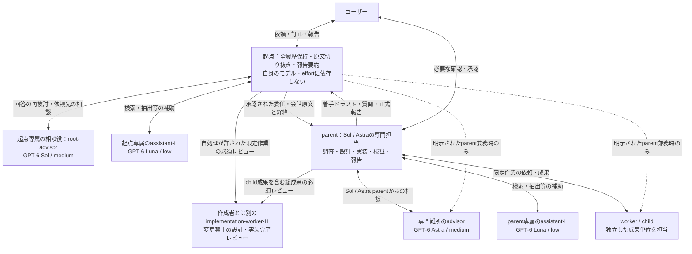
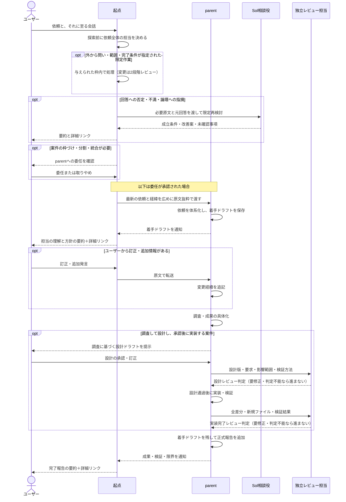

# Codexサブエージェントの全体像と設計コンセプト

## 位置づけ

この資料は、構成と設計意図を知りたい人向けのアウトラインです。エージェントへの行動指示ではありません。詳細な手順・権限・記録方法は、下記のリンク先にあるエージェント向け指示とテンプレートを正本とします。

モデル別の一覧や評価状況は[編成・モデル設定資料](codex-agent-model-selection.md)を参照してください。ここでは役割と情報の流れを説明します。

## まず全体像をつかむ

ユーザーが会話するメインのエージェントを「起点」、専門案件を一貫して担当するエージェントを「parent」、その中の独立した作業を担当するエージェントを「worker（child）」と呼ぶ。assistantは軽作業の補助、advisorは相談役である。

起点は会話の保持・原文の受け渡し・報告と、ユーザーまたはparentから問い・範囲・完了条件が与えられた限定作業を担います。案件の枠づけ・分割・専門的な統合はparentが担い、起点が先行調査で自処理の枠を作ることは認めません。回答への指摘はSol相談役、parentの難所はAstra相談役で扱います。起点がparentを兼ねるのはユーザーが明示した範囲だけです。

矢印は情報の受け渡しを示します。全員を一斉に起動する構成ではなく、案件に必要な担当を利用します。起動できる相手の詳細は[委任共通規約](../dot_codex/common/sub-agent.md.tmpl)にあります。

## 依頼から完了までの流れ

着手ドラフトは当初理解の記録であり、承認済みの設計案とは別です。変更経緯と正式報告を併存させ、起点が要約と詳細リンクを届けます。通知で回収し、進捗をポーリングしません。詳細な条件・例外は以下の正本にあります。

コード・設定・文書の変更では、担当が起点でもparentでも、設計通過前に実装せず、実装完了レビュー通過前に完了宣言・引き渡しをしません。小さな変更も資料を短くして2段階を維持します。設計や差分が変われば該当段階を再レビューし、対象版・別担当の判定・指摘対応を記録します。自己点検・テスト・ユーザー承認では代替しません。詳細は[変更レビューの正本](../.chezmoitemplates/agent/codex/change-review.md)にあります。

childの個別成果は、設計・作成に関与したparentが内部レビューして統合できます。独立レビューの対象は全child成果を含む総成果であり、総成果の設計者が作成側とは別個体のレビュアーを手配します。childごとの独立レビュアーは必須ではありません。rootが直接担当する総成果も、同じ2段階の独立レビューを受けます。

## 役割と、対応するエージェント向け指示

| 役割・論点 | 人向けの要点 | 指示・テンプレートの正本 |
| --- | --- | --- |
| 起点 | 全履歴保持・原文切り抜き・報告要約と詳細リンク・外から範囲を指定された限定作業 | [起点規約](../dot_codex/common/root-agent.md.tmpl) |
| parent | 依頼を解釈し、専門案件と業務報告を一貫して担う | [共通本文](../.chezmoitemplates/agent/codex/parent.md)、[Sol/Astra用](../.chezmoitemplates/agent/codex/parent-advanced.md) |
| worker / child | 独立した成果単位を調査・実装・検証する | [末端担当の共通本文](../.chezmoitemplates/agent/codex/child.md)、[調査用](../.chezmoitemplates/agent/codex/research-worker.md)、[実装用](../.chezmoitemplates/agent/codex/implementation-worker.md) |
| assistant-L | 起点・parentそれぞれの検索、抽出、整理を補助する | [assistant定義](../dot_codex/agents/assistant-L.toml.tmpl) |
| root-advisor | ユーザーに否定された回答の限定再検討とルーティングを補助する | [起点専属相談役の定義](../dot_codex/agents/root-advisor.toml.tmpl) |
| advisor | parentの難所を分析し、parentが検証・統合する | [専門顧問の定義](../dot_codex/agents/advisor.toml.tmpl) |
| 起動・権限・記録 | 誰が誰を利用できるか、記録をどう保持するかを定める | [委任共通規約](../dot_codex/common/sub-agent.md.tmpl) |
| 変更の2段階レビュー | child成果は関与parentが内部レビュー。総成果は別個体が設計・実装完了を判定 | [変更レビュー本文](../.chezmoitemplates/agent/codex/change-review.md) |
| 共通の入口 | プロジェクトの指示と併せて適用する共通方針 | [Codex向けAGENTSテンプレート](../dot_codex/AGENTS.md.tmpl) |

リンク先は配布元のsourceです。設定と評価は[編成資料](codex-agent-model-selection.md)、編集時の責務・重複の基準は[保守ルール](instruction-maintenance.md)にあります。

## 共通の検討姿勢

全ロールに[仮説・提案の基本姿勢](../.chezmoitemplates/agent/codex/hypothesis.md)を適用する。現実的な条件付き成立を細かな否定より優先し、根幹を覆す論拠がなければ条件と改善案を示す。childの報告もこの姿勢で評価する。parentの難所はAstra相談役とparentが扱い、通常起点へ専門判断を戻さない。

## この構成で確かめたいこと

会話文脈の受け渡しを起点に、専門的な解釈と遂行をparentに置くことで、起点の解釈による制約とメインスレッドの負担を減らす狙いがあります。parentはSol/Astraに限定し、Lunaは再委任しないassistant・workerとして利用します。起点のモデルを固定せず、役割とユーザーの明示指示で責務を区別します。品質・消費量の改善は実証済みとは扱いません。

比較手順と未検証範囲は[評価計画](codex-agent-model-selection.md#評価計画)・[検証の扱い](codex-agent-model-selection.md#検証の扱い)を参照してください。sourceの変更と、実環境への適用は別の作業です。
