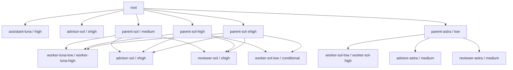

# Codexエージェントチーム

職能別ロールを廃止し、案件の負荷と判断の難しさに応じてParentを選ぶ。定型的で負担の小さい案件にはSol / medium、小〜中規模の案件にはSol / highまたはxhighを基本とし、全体判断が難しい具体的な高難度案件ではAstra / lowを候補にする。案件の規模だけでAstraを選ばない。現設定の根拠と変更経緯は [モデル選択資料](codex-agent-model-selection.md) に記録する。

## 階層と役割

階層は案件の責任範囲、役割は担当する仕事を表す。root / parent / childの関係と、worker / advisor / reviewerの役割を分けて読む。

| 階層 | 責任 | 対応する担当 |
| --- | --- | --- |
| root | ユーザーとの対話、全会話の経緯、担当選択、成果への導線 | この会話を受け持つエージェント。専用の起動ロールは定義しない |
| parent | 案件の企画、分割・指示、childの受入、統合、独立レビューの手配 | `parent-sol` / `parent-sol-high` / `parent-sol-xhigh` / `parent-astra` |
| child | 指定範囲の仕事を返す末端担当。再委任しない | worker / advisor / reviewer。root直轄のassistant・advisorも末端担当 |

| 役割 | 担当する仕事 | 成果の使い方 |
| --- | --- | --- |
| worker | 指示された範囲の調査・実行・検証 | parentが指示への適合を確認して統合する |
| advisor | 前提、方針、選択肢、成立条件の検討 | 依頼元が助言の採否を判断する |
| reviewer | 原依頼とparentの解釈・成果を独立評価 | ユーザーへ返せるかを判定する |
| assistant | rootが指定した検索・読解・抽出・要約 | rootが必要な結果と根拠を回収する |

## Parentの選択

| 案件 | parent | worker | advisor / reviewer |
| --- | --- | --- | --- |
| 定型的・低負担 | Sol / medium | Luna / low または high | Sol / xhigh |
| 小〜中規模（基本） | Sol / high または xhigh | Luna / low または high。方針確定・境界明確・受入容易な局所作業ならSol / lowも選択可能 | Sol / xhigh |
| 全体判断が難しい具体的な高難度 | Astra / low | Sol / low または high | Astra / medium |

advisorとreviewerは同じ設定でも別個体で担当する。root直轄の補助は `assistant-luna`（Luna / high）、相談は `advisor-sol`（Sol / xhigh）。全13ロールの識別子と設定は [モデル選択資料](codex-agent-model-selection.md) を参照する。

下図の矢印は起動・依頼の関係を示す。worker、advisor、reviewerの間に上下関係はない。

```mermaid
flowchart TD
  root --> Assistant[assistant-luna / high]
  root --> rootAdvisor[advisor-sol / xhigh]
  root --> Sol[parent-sol / medium]
  root --> SolH[parent-sol-high]
  root --> SolX[parent-sol-xhigh]
  root --> Astra[parent-astra / low]
  Sol --> Luna["worker-luna-low / worker-luna-high"]
  SolH --> Luna
  SolH --> WorkerSolLow[worker-sol-low / conditional]
  SolX --> Luna
  SolX --> WorkerSolLow
  Sol --> SA[advisor-sol / xhigh]
  SolH --> SA
  SolX --> SA
  Sol --> SR[reviewer-sol / xhigh]
  SolH --> SR
  SolX --> SR
  Astra --> WorkerSol["worker-sol-low / worker-sol-high"]
  Astra --> AA[advisor-astra / medium]
  Astra --> AR[reviewer-astra / medium]
```

rootは会話の経緯を保ち、外から範囲を指定された限定作業だけを直接扱う。その他はParentへ渡し、明示された場合などにParentを兼務する。定型的で負担の小さい案件はSol / medium、小〜中規模の案件はSol / highまたはxhighを基本にし、案件の規模ではなく全体判断の難しさが際立つ具体的な高難度案件ではAstra / lowを選ぶ。難度と作業量がともに大きい案件では、第三の編成を作らず、計画レビューとユーザー承認を経て実作業へ進む。

Parentはrootの全履歴から分離されているため、履歴分離だけを目的にworkerを起動しない。起動・引継ぎ・検査・再依頼を含めても完了時間または実効費用の改善が見込める独立した作業を委任する。rootのLuna補助はhigh固定。明示的なParent兼務時もLuna lowは使わない。Sol / high・xhigh ParentはLuna workerを基本とし、方針確定・境界明確・受入容易な局所作業ならSol / low workerも選べる。Astra ParentはSol low/highを使う。細部は [チーム連携](../.chezmoitemplates/agent/team/coordination.md) と [Codexチーム設定](../dot_codex/common/team.md.tmpl) を参照する。

## 異なる二つの品質基準

| 担当 | 入力 | 評価するもの |
| --- | --- | --- |
| Parent | childへの指示と結果 | 指示への適合、工程・内容・根拠・検証の妥当性 |
| Reviewer | Parentへの原依頼、解釈・方針、計画または最終成果 | ユーザー意図、論理の根幹、重要要求の充足、返却可能性 |

Parentはchildの受入時に要求を再解釈しない。指示が悪ければ指示の修正として扱う。Reviewerは細かな指摘数を成果にせず、結論や利用可能性を損なう問題に集中する。

Parentがユーザーへ返す計画・最終成果は独立レビューを経る。計画を別途返さず完結する依頼に形式的な二段階レビューは追加しない。childの途中報告、rootの限定作業は一律対象外。AdvisorとReviewerは同じ設定でも別個体とし、助言履歴による誘導を避ける。見解相違が解消しなければParentがユーザーに確認する。ゲートの正本は [共通フロー](../.chezmoitemplates/agent/team/flow.md) とする。

## 情報と成果の流れ

必要な原文・確定条件・権限をrootからParentへ渡し、Parentが実行可能な指示へ具体化する。workerは局所成果と根拠を返す。Parentは受入・統合・独立レビューを経て、短い結論と成果物へのリンクをrootへ返す。履歴に長大な出力を積むことを成果保存の代わりにしない。

通常の実作業では次の順で進む。

1. rootが原依頼・確定条件・権限をparentへ渡す。
2. parentが方針と受入条件を具体化し、委任の利点が見込める場合はworkerへ範囲を切り出す。相談が必要ならadvisorを使う。
3. parentがworkerの結果を受け入れ、案件全体の成果へ統合する。
4. 別個体のreviewerが原依頼・解釈・成果を評価する。要修正・判定不能ならparentが対応し、再確認を受ける。
5. parentが結論・検証・限界と成果物リンクをrootへ返し、rootがユーザーへ伝える。

計画を先にユーザーへ返す場合は、その計画もレビュー対象になる。難しい・大量の案件では、この計画レビューとユーザー承認を実作業の前に置く。rootがparentを明示的に兼務する場合も同じ責任を持つが、Lunaはhigh固定とする。

共有済みログ・検証は再利用する。難しい作業の並列化を標準手順にはしない。情報共有方式の詳細再編はTODOとし、現段階では案件別作業領域と必要な状態・レビュー記録を維持する。

## 正本

- [共通フロー](../.chezmoitemplates/agent/team/flow.md)：担当選択・レビュー・承認の順序
- [チーム連携](../.chezmoitemplates/agent/team/coordination.md)：rootとParentの企画・委任・child受入・記録
- [Codexチーム設定](../dot_codex/common/team.md.tmpl)：製品別の編成表・識別子・モデル対応
- [Worker](../.chezmoitemplates/agent/team/worker.md)、[Advisor](../.chezmoitemplates/agent/team/advisor.md)、[Reviewer](../.chezmoitemplates/agent/team/reviewer.md)：担当別規範
- [設定と決定根拠](codex-agent-model-selection.md)：暫定設定・変遷・受入ケース

本資料はCodex編成の説明であり、運用時に別の条件を追加する正本ではない。Claudeも共通の担当・レビュー原則を使い、製品別の起動方法は末端テンプレートが定める。
